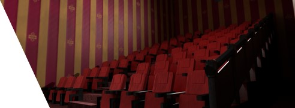
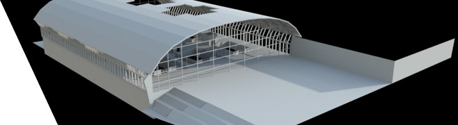
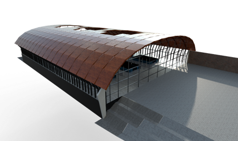
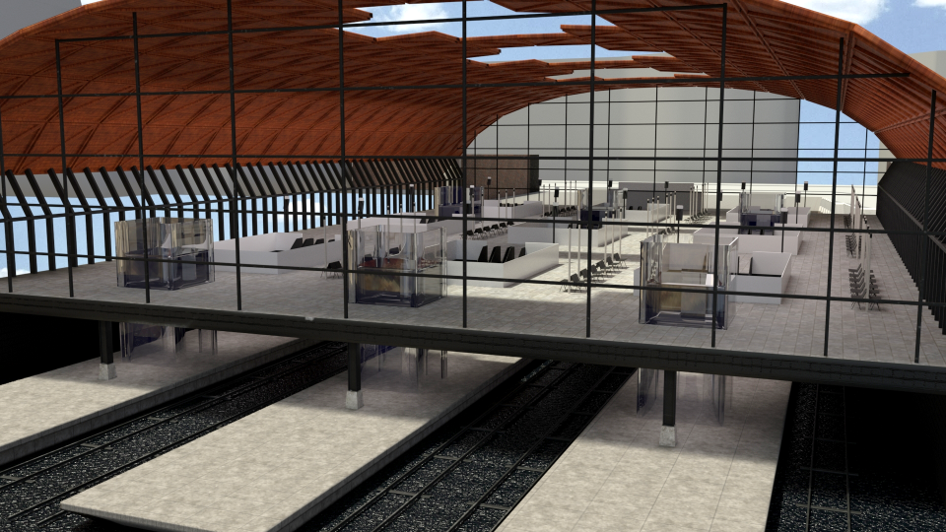

# TeamInceptio

A university group project I was involved in creating assets.

Within this project, a group of us created a working VR scene of Birmingham's new railway station Curzon Street Station as part of HS2 rail project in the UK.

## Screenshots
### Cinema Render

### Untextured Render

### Textured Render

### Close up Render

## Quick Speed Run Video
Click on the image to watch

